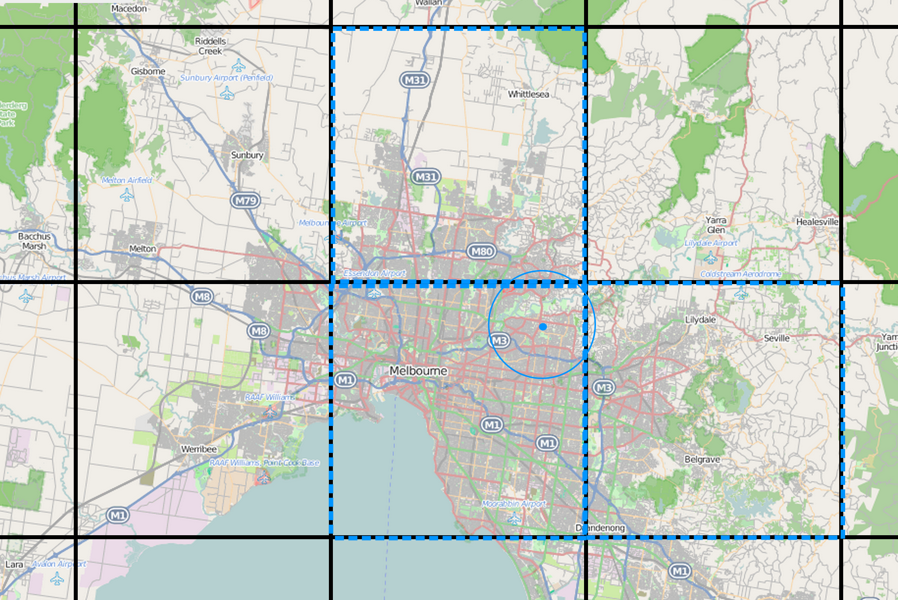

### Partitioning location signals based on:
- Geo-Hash for 150x150m tiles
- Timestamp
- UUID

This is a simple example of how to use the [Geo-Hash](https://en.wikipedia.org/wiki/Geohash) partitioning method to partition a dataset into 150x150m tiles.

## Description


Geospacial data is often partitioned into tiles to allow for efficient querying of data. The most common method is to use a [Quad-Tree](https://en.wikipedia.org/wiki/Quadtree) which is a recursive partitioning of a space into four equal parts. This is a very efficient method but it is not very flexible. For example, if you want to partition a space into 150x150m tiles, you will need to use a very deep quad-tree. This is not a problem if you are only interested in querying data but it can be a problem if you want to use the partitioning to generate a dataset for training a machine learning model.

[More info](https://tarunjain07.medium.com/geospatial-geohash-notes-15cbc50b329d)

## Proposed data structure for location signals

Location data stored as binary files which contains byte array of the following structure, so 
each entry is only 16 bytes long. The size can not be lower because double type used for Lat/Lon is 8 bytes long.

`double[][] = {{lat, lon}, {lat, lon}};`

`{GEO_TILE_HASH}/{YEAR}/{MONTH}/{DAY}/{HOUR}/{UUID}.bin` e.g. 
`s0gs30g/23/01/10/22/e3000534-1b63-437d-a1d6-8ff7e0f19c75`
```shell
.
├── 7zhzwy0
│   └── 22
│       └── 03
│           └── 20
│               └── 16
│                   └── SSiWXd-hQY2yRWJgddZAIg.bin
├── 7zhzzzh
│   └── 22
│       └── 04
│           └── 01
│               └── 09
│                   └── XR5oQZRsRc2GX9W5d9uybg.bin
├── 7zm0dtm
│   └── 22
│       └── 11
│           └── 29
│               └── 12
│                   └── DIpqyU9CRXmczKMyFyG8hA.bin
├── 7zm601m
│   └── 23
│       └── 01
│           └── 20
│               └── 14
│                   └── OFLENd_0To2b5qDTqmwjYw.bin

```
`{GEO_TILE_HASH}/{{YEAR}.{MONTH}.{DAY}.{HOUR}}/{UUID}.bin` e.g. `s0gs3y0/22.04.12.
23/2d2cd81c-8b19-44e1-96d5-35a7773f235c`

Files structure looks the following:
```shell
.
├── 7zhs00d
│   └── 22
│       └── 12.31.09
│           └── 3BllKLb4SDWLbJYtcov1xg.bin
├── 7zhy31w
│   └── 22
│       └── 04.01.08
│           └── cn9B_BPCTzWpuZr39Sg9Tw.bin
├── 7zm0gtz
│   └── 22
│       └── 11.13.10
│           └── dNUhyJbISu6s5wF9TituSw.bin
├── 7zm6dzz
│   └── 22
│       └── 08.21.08
│           └── 2SJQCZCnRrOJpVAVP9lgPw.bin
├── 7zw1z6g
│   └── 22
│       └── 03.20.10
│           └── W4mjlzpnTjuMhN_dFh50rA.bin
```

### Usage 

This is a Java code package that generates random coordinates within a specified radius and calculates the number of users seen around a point of interest (POI) using two different methods - by walking and by recursion.

Requirements
Java 8 or higher
ch.hsr.geohash package

characters - The number of characters in the GeoHash representation of the coordinates.
radiusAroundPoint - The radius (in meters) around each POI to consider when calculating the number of users seen.
numberOfCoordinates - The number of random coordinates to generate.
numberOfPois - The number of POIs to generate.
PREFIX - The prefix for the file path where the generated coordinates will be saved.

### Test 5.000.000 signals generated (CPU 12 cores, 32gb RAM, SSD)

---------------------------------
Scoring users seen around 100000 POI by walk
Total amount of users exposed by walk: 1911
Generate time: 2254 seconds
---------------------------------
Scoring users seen around 100000 POI by recursion
Total amount of users exposed by recursion: 1911
Generate time: 1972 seconds